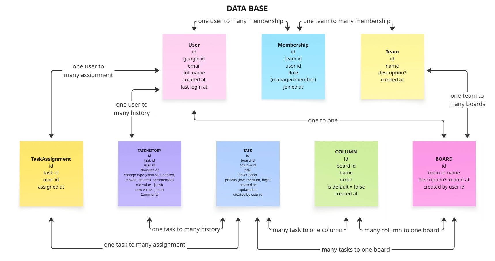

# Kanban  WebAPI
REST API for a Kanban task management system. Allows creating teams, boards, columns, tasks, and tracking task history.
The backend is written in ASP.NET Core 9 using Entity Framework and PostgreSQL. Authentication is via Google OAuth 2.0.
---
## Team Members
| Member              | Responsibility                 |
|---------------------|--------------------------------|
| Maria Lebedeva      | Testing & Quality Assurance    |
| Daria Burtseva      | Data Access Layer && Database  | 
| Yevgeniy Zadorozhny | Bisness Logic Layer            |        
| Ivan Nikolaev       | WebApi (Presentation Layer)    |       
---
## Features
- Authorization via Google OAuth 2.0
- Team and member management
- Board creation and automatic **Backlog** column
- Task and assignee management
- Task change history (`TaskHistory`)
- Swagger UI for API testing
---
## Technologies
- ASP.NET Core 9
- Entity Framework Core
- PostgreSQL
- Swagger
- Google OAuth 2.0
---
## Project Architecture
The project is implemented using a multi-layer architecture using Entity Framework Core to work with the PostgreSQL database.

### Project layers:
- **WebApi (Presentation Layer)** – the presentation layer, containing controllers that receive HTTP requests and return responses in JSON format.
- **Business Logic Layer (BLL)** – the business logic layer where data processing, validation, and repository method calls are performed.
- **Data Access Layer (DAL)** – the data access layer, implementing interaction with the PostgreSQL database via Entity Framework Core. This layer includes the database context, entity configurations, and migrations.
  Each layer depends only on the layer below it:  
  `WebApi → BLL → DAL (EF Core + PostgreSQL)`

### Database entities:
- `User` — user (authorization via Google)
- `Team` — team
- `Membership` — user-team relationship with a role (Manager/Member)
- `Board` — board
- `Column` — column 
- `Task` — task
- `TaskAssignment` — task assignee
- `TaskHistory` — change history
<!--  -->